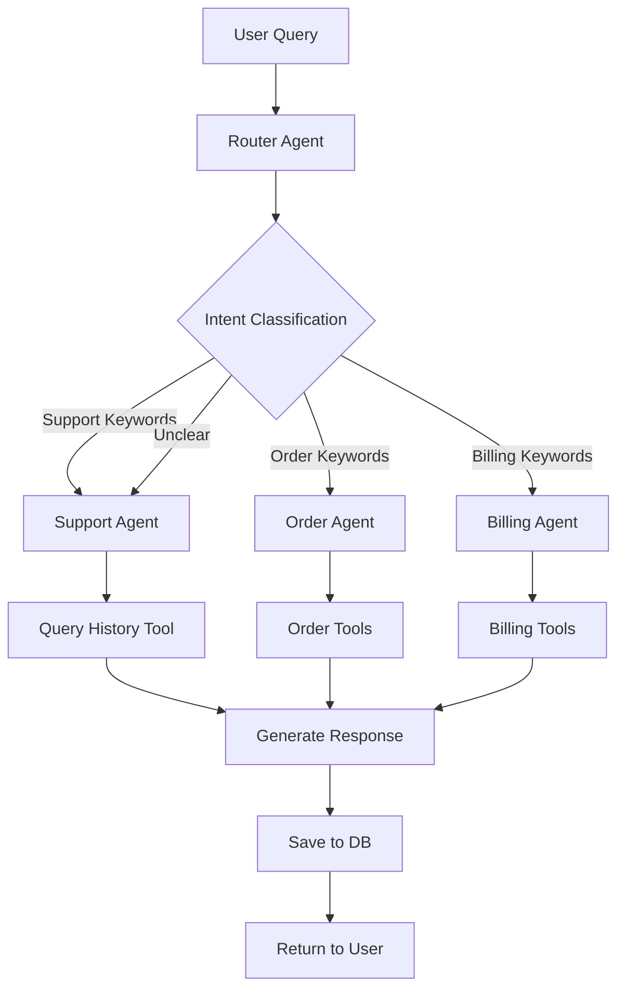
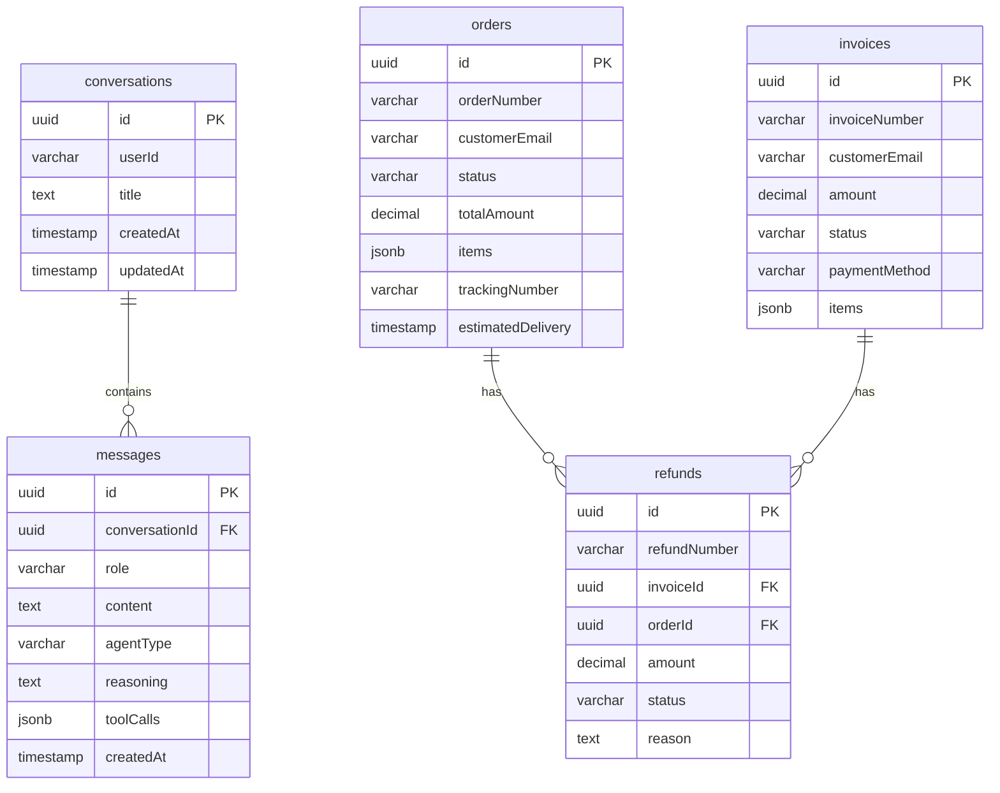

# AI-Powered Customer Support System - Architecture

## Overview

This document provides detailed technical documentation of the multi-agent customer support system architecture, design decisions, and data flows.

## System Architecture

### High-Level Architecture

```
┌──────────────────────────────────────────────────────────────┐
│                        Frontend (React)                       │
│  ┌────────────────────────────────────────────────────────┐  │
│  │  ChatInterface → MessageList → MessageInput            │  │
│  │  useChat Hook → Hono RPC Client                        │  │
│  └────────────────────────────────────────────────────────┘  │
└────────────────────────┬─────────────────────────────────────┘
                         │ HTTP/JSON
                         │
┌────────────────────────▼─────────────────────────────────────┐
│                    Backend (Hono.dev)                         │
│  ┌─────────────────────────────────────────────────────────┐ │
│  │  Middleware Layer                                       │ │
│  │  ├── Error Handler                                      │ │
│  │  ├── Rate Limiter                                       │ │
│  │  └── CORS                                               │ │
│  └─────────────────────────────────────────────────────────┘ │
│  ┌─────────────────────────────────────────────────────────┐ │
│  │  Controllers                                            │ │
│  │  ├── ChatController                                     │ │
│  │  └── AgentsController                                   │ │
│  └─────────────────────────────────────────────────────────┘ │
│  ┌─────────────────────────────────────────────────────────┐ │
│  │  Services                                               │ │
│  │  └── ChatService (Business Logic)                       │ │
│  └─────────────────────────────────────────────────────────┘ │
└────────────────────────┬─────────────────────────────────────┘
                         │
          ┌──────────────┴───────────────┐
          │                              │
┌─────────▼──────────┐        ┌─────────▼────────────┐
│  Multi-Agent       │        │   Database           │
│  System            │        │   (PostgreSQL)       │
│  ┌──────────────┐  │        │  ┌────────────────┐  │
│  │ Router Agent │  │        │  │ conversations  │  │
│  └──────┬───────┘  │        │  │ messages       │  │
│         │          │        │  │ orders         │  │
│    ┌────┴────┐     │        │  │ invoices       │  │
│    │         │     │        │  │ refunds        │  │
│    ▼         ▼     │        │  └────────────────┘  │
│  ┌────┐   ┌────┐  │        └─────────────────────┘
│  │Sup │   │Ord │  │
│  │port│   │er  │  │
│  └────┘   └────┘  │
│    ▼              │
│  ┌──────────┐     │
│  │ Billing  │     │
│  └──────────┘     │
└───────────────────┘
```

## Multi-Agent System Design

### Router Agent Flow



### Intent Classification Logic

The Router Agent uses LLM-based classification with the following prompt strategy:

```
Keywords Analysis:
- SUPPORT: password, reset, help, troubleshoot, how to, account
- ORDER: order, track, delivery, shipping, cancel, ORD-
- BILLING: refund, invoice, payment, subscription, INV-, REF-
- GENERAL: hello, hi, thanks, thank you
```

## Data Flow

### Message Send Flow

1. **User Input** → Frontend captures message
2. **API Call** → POST /api/chat/messages
3. **Controller** → Validates request with Zod
4. **Service** → 
   - Creates/retrieves conversation
   - Saves user message to DB
   - Fetches conversation history
5. **Router Agent** → Classifies intent
6. **Sub-Agent** → 
   - Invokes specialized agent
   - Calls relevant tools
   - Generates response
7. **Service** →
   - Saves assistant message
   - Returns response
8. **Frontend** → Displays message with agent badge

### Tool Execution Flow

```
Agent → Tool Call → Database Query → Result → LLM Context → Final Response
```

Example: Order Agent with fetchOrderDetails
```typescript
User: "Where is order ORD-2024-001?"
  ↓
Router: "ORDER" classification
  ↓
Order Agent: Invokes fetchOrderDetails tool
  ↓
Tool: db.select().from(orders).where(eq(orders.orderNumber, 'ORD-2024-001'))
  ↓
Result: { status: 'shipped', tracking: 'TRK123', eta: '2024-01-25' }
  ↓
LLM: Generates natural language response
  ↓
Response: "Your order ORD-2024-001 has been shipped. Tracking: TRK123..."
```

## Database Schema

### Entity Relationship Diagram



## Context Management

### Token Limit Handling

The system implements intelligent context compaction to stay within LLM token limits:

```typescript
MAX_TOKENS = 6000 (conservative limit)

Strategy:
1. Estimate tokens (1 token ≈ 4 characters)
2. Calculate total message tokens
3. If > 80% of limit:
   - Keep system messages
   - Keep recent N messages
   - Add "[Earlier messages truncated]" marker
4. Else: Use full history
```

### Context Window

```
[System Prompt] (200-300 tokens)
[Conversation History] (variable, max 5000 tokens)
[Current User Message] (variable)
[Response Buffer] (1000 tokens reserved)
```

## API Design Patterns

### Controller-Service Pattern

```
Request → Controller → Service → Database/Agents
                ↓
            Validation
                ↓
            Error Handling
```

**Benefits:**
- Separation of concerns
- Testable business logic
- Reusable services
- Clean error handling

### Error Handling

All errors flow through centralized middleware:

```typescript
Request → Route Handler → Service
            ↓ (throws error)
       Error Middleware
            ↓
       Format Response
            ↓
       Return JSON + Status Code
```

Error Response Format:
```json
{
  "error": "Human-readable message",
  "status": 400|404|500,
  "details": [] // Optional validation errors
}
```

## Performance Optimizations

### Database Queries

- **Indexed Columns**: conversationId, orderNumber, invoiceNumber
- **Limit Clauses**: All list queries limited to prevent large result sets
- **Cascade Deletes**: Conversation deletion automatically removes messages

### Frontend Optimizations

- **React.memo**: Prevents unnecessary re-renders
- **useCallback**: Memoizes event handlers
- **Lazy Loading**: Could add for conversation list
- **Debouncing**: Could add for typing indicators

### Rate Limiting

In-memory store with cleanup:
- 60 requests per minute per IP
- Automatic cleanup of old entries every 5 minutes
- Returns 429 with Retry-After header

For production, recommend Redis-based rate limiting.

## Security Considerations

### Input Validation

- Zod schemas for request validation
- SQL injection prevention via Drizzle ORM parameterized queries
- XSS prevention via React's built-in escaping

### Authentication (Future Enhancement)

Current system uses simple userId field. Recommended additions:
- JWT authentication
- Session management
- User roles and permissions
- API key authentication for programmatic access

### Data Privacy

- No PII logged
- Database credentials in environment variables
- Separate development/production environments

## Testing Strategy

### Unit Tests

```typescript
describe('Router Agent', () => {
  it('classifies order queries correctly', async () => {
    const result = await classifyIntent("Where is my order?");
    expect(result).toBe('ORDER');
  });
});
```

### Integration Tests

```typescript
describe('POST /api/chat/messages', () => {
  it('creates conversation and returns response', async () => {
    const response = await request(app)
      .post('/api/chat/messages')
      .send({ message: 'Hello' });
    
    expect(response.status).toBe(200);
    expect(response.body.data.conversationId).toBeDefined();
  });
});
```

## Scalability Considerations

### Current Architecture

- Suitable for: 100-1000 concurrent users
- Database: Single PostgreSQL instance
- Rate Limiting: In-memory (single server)

### Scaling Recommendations

1. **Horizontal Scaling**
   - Load balancer (Nginx/AWS ALB)
   - Multiple backend instances
   - Redis for rate limiting
   - Centralized session store

2. **Database Scaling**
   - Read replicas for queries
   - Connection pooling (PgBouncer)
   - Database indexing optimization

3. **Caching**
   - Redis cache for agent capabilities
   - Cached conversation history
   - CDN for static assets

4. **Monitoring**
   - Application metrics (response times, error rates)
   - Database metrics (query performance)
   - LLM metrics (token usage, latency)

## Future Enhancements

### Short-term
- [ ] Streaming responses with Server-Sent Events
- [ ] File upload support (for attachments)
- [ ] Multi-language support
- [ ] Voice input/output

### Long-term
- [ ] Advanced analytics dashboard
- [ ] A/B testing for agent prompts
- [ ] Custom agent training
- [ ] Integration with external systems (CRM, helpdesk)
- [ ] Mobile app (React Native)

## Development Workflow

### Monorepo Benefits

1. **Code Sharing**: Shared types between frontend/backend
2. **Atomic Commits**: Frontend + backend changes in single commit
3. **Build Optimization**: Turborepo caches unchanged packages
4. **Type Safety**: Hono RPC provides end-to-end types

### Git Workflow

```
main (production)
  ↓
develop (staging)
  ↓
feature/* (development)
```

## Deployment Architecture

### Recommended Setup

```
Frontend (Vercel/Netlify)
    ↓
Backend (Railway/Render)
    ↓
Database (Neon/Supabase PostgreSQL)
```

### Environment Variables per Environment

**Development**
- DATABASE_URL: localhost
- AI_MODEL: smaller/faster model for testing
- NODE_ENV: development

**Production**
- DATABASE_URL: managed database URL
- AI_MODEL: production model
- NODE_ENV: production
- Rate limits: stricter

---

This architecture is designed for maintainability, scalability, and developer experience while meeting all assessment requirements.
